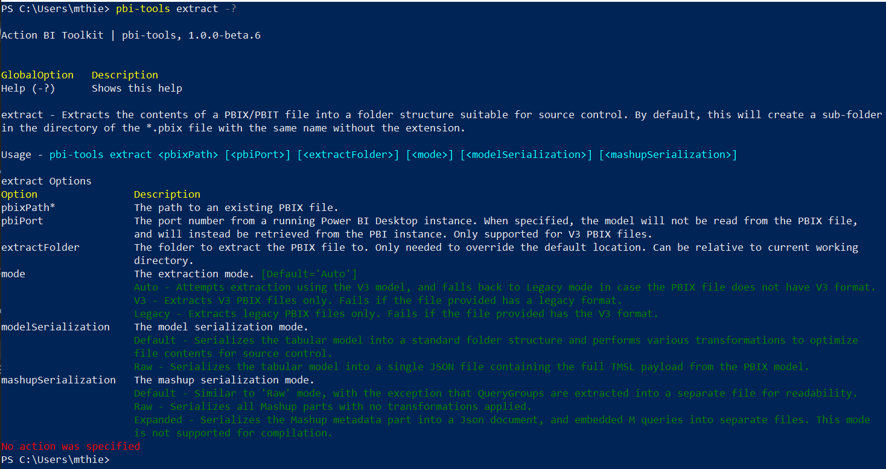

# Action BI Toolkit | pbi-tools

`pbi-tools` is a command-line tool bringing source-control features to Power BI. It works alongside Power BI Desktop and enables mature enterprise workflows for Power BI projects.

An example project is available here: <https://github.com/action-bi-toolkit/adventureworksdw2020-pbix>

Watch <https://www.action-bi.com/action-bi-toolkit> for further info. More docs are coming!

## User Notes

### Installation

Download the tool as a ZIP file (no installer required) from [Releases](https://github.com/action-bi-toolkit/pbi-tools/releases/latest) (under _Assets_). Extract and run from a command prompt.

Make sure to [unblock the ZIP file before extracting](https://singularlabs.com/tips/how-to-unblock-a-zip-file-on-windows-10/).

### Tool Actions

* **[extract](./docs/Usage.md#extract)** • _Extracts the contents of a PBIX/PBIT file into a folder structure optimized for source control_
* **[compile-pbix](./docs/Usage.md#compile-pbix)** • _Generates a PBIX/PBIT file from sources. PBIX is supported for report-only files, PBIT for files containing models_
* **[export-bim](./docs/Usage.md#export-bim)** • _Generates a BIM file deployable to an XMLA endpoint from sources. Supports both Power BI Premium and Azure Analysis Services_
* **[extract-data](./docs/Usage.md#extract-data)** • _Exports all tables into CSV files from either an offline PBIX file or a running Power BI Desktop session_
* **[info](./docs/Usage.md#info)** • _Prints diagnostics info about the local Power BI environments. Optionally checks for the latest Power BI Desktop release available from Microsoft Downloads_
* **[launch-pbi](./docs/Usage.md#launch-pbi)** • _Launch a new Power BI Desktop instance with a given PBIX/PBIT file. Does not support Windows Store version_

### Detailed Usage Notes

See [detailed CLI docs here](./docs/Usage.md).

Running `pbi-tools.exe` with no actions specified prints all available options.

Running `pbi-tools {action} -?` prints usage details for that specific action.

### Prerequisites

* Windows 64-bit
* Power BI Desktop 64-bit. Installer version (default location) and/or Windows Store version supported. Optionally, `pbi-tools` works with Power BI Desktop in a custom location, provided the path is specified in the `PBITOOLS_PbiInstallDir` environment variable.
* .Net Framework Runtime 4.7.2 (Comes with Power BI Desktop)

### Command-line Syntax

    -argumentName argumentValue
    /argumentName:argumentValue
    -argumentName                   - If the argument is a boolean it will be true in this case.

### Diagnostics

* Log output can be controlled using the environment variable `PBITOOLS_LogLevel`.
* Allowed values are:
  - Verbose
  - Debug
  - Information
  - Warning
  - Error
  - Fatal
* The default is ***Information***, which is also effective when an unknown/invalid option has been specified.

## Developer Notes

### Build System

* All build targets are implemented using [FAKE](https://fake.build/).
* Dependencies are managed using [Paket](https://fsprojects.github.io/Paket/).
* Main entry point for all build tasks is `.\build.cmd`.
* The [fake-cli](https://fake.build/fake-commandline.html) tool is installed as a [local .NET Core Tool](https://docs.microsoft.com/en-us/dotnet/core/tools/global-tools#install-a-local-tool), see [.config\dotnet-tools.json](./.config/dotnet-tools.json). That's why a .Net Core 3.x SDK is required to build the project. The `build.cmd` script handles the tool installation.

### Prerequisites

* Visual Studio 2019 (for MSBuild dependencies)
* .Net Core SDK 3.x or later
* Power BI Desktop x64 (Must be installed in default location for local development: `C:\Program Files\Microsoft Power BI Desktop\`)

### Versioning

### Build

    .\build.cmd Build

### Run Tests

    .\build.cmd Test

### Run only the specified build target

    .\build.cmd UsageDocs -s

### Install Dependencies

    dotnet paket install

_That is generally not needed as the `build.cmd` script takes care of fetching dependencies. However, it could be useful to run this manually on a fresh clone or after making changes in the `paket.dependencies` file._

### Update Dependency to latest version (ex: AMO)

    dotnet paket update Microsoft.AnalysisServices.retail.amd64
    dotnet paket update Microsoft.AnalysisServices.AdomdClient.retail.amd64

### Updating Build Dependencies

    dotnet paket update -g Fake-Build

### Find outdated dependencies

    dotnet paket outdated -g Main

### Invoke Build script directly

    dotnet fake {...}
    dotnet fake -t Build
    dotnet fake --version

### Run single build target

    dotnet fake build -s -t SmokeTest

### Extract embedded sample PBIX with local build version and using default settings

    .\pbi-tools.local.cmd extract '.\data\Samples\Adventure Works DW 2020.pbix'

### Extract embedded sample PBIX with local build version and 'Raw' serialization mode, into custom output folder

    .\pbi-tools.local.cmd extract '.\data\Samples\Adventure Works DW 2020.pbix' -extractFolder '.\data\Samples\Adventure Works DW 2020 - Raw' -modelSerialization Raw
